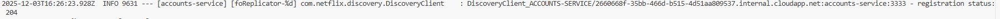
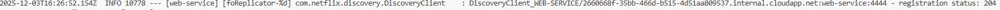

# Lab 6 Microservices - Project Report

## 1. Configuration Setup

**Configuration Repository**: [[Link to your forked repository](https://github.com/AlexAs33/I.Web_P6_Microservices.git)]

Describe los cambios que hiciste a la configuración:

### Modificaciones en `accounts-service.yml`

El archivo de configuración local `config/config/accounts-service.yml` fue modificado para cambiar el puerto en el que se ejecuta la nueva instancia del servicio de cuentas, según lo requerido por la Tarea 3.

El cambio específico realizado fue:

```yaml
server:
  port: 2222
```

### Utilidad de la Configuración Externalizada

La Configuración Externalizada es un patrón de microservicios implementado aquí por el **Spring Cloud Config Server**.

* **Centralización:** Permite almacenar la configuración de todas las aplicaciones (como el puerto o la lógica de la base de datos) fuera del código fuente de la aplicación.
* **Gestión:** Los servicios (como `accounts` y `web`) obtienen su configuración del Config Server al iniciar.
* **Aislamiento:** Permite cambiar configuraciones (como el puerto) sin tener que reconstruir y reimplementar los servicios.

---

## 2. Service Registration (Task 1)

### Accounts Service Registration



**Explain what happens during service registration:**
El **registro de servicio** es el mecanismo mediante el cual un microservicio se anuncia a sí mismo en el sistema, permitiendo que otros servicios lo encuentren.
1.  **Inicio del Cliente:** El microservicio, en este caso el **`accounts-service`** (que actúa como cliente Eureka), se inicia y establece comunicación con el servidor de descubrimiento.
2.  **Notificación al Servidor:** El cliente envía una petición al servidor de descubrimiento (**Eureka Server**), en este caso al **`discovery-service`**. Esta petición notifica al servidor su información esencial:
    * Su **nombre** lógico de aplicación: **`ACCOUNTS-SERVICE`**.
    * Su **dirección IP** y el **puerto** donde está escuchando (inicialmente 3333).
3.  **Registro Dinámico:** El servicio se registra de forma **dinámica**, lo que significa que su ubicación se conoce en tiempo de ejecución, no mediante configuración manual.
4.  **Confirmación:** El registro se completa con éxito, como indica el código de estado HTTP **`registration status: 204`**, que significa que la petición fue procesada correctamente y no hay contenido que devolver.

### Web Service Registration



**Explain how the web service discovers the accounts service:**
El `web-service` usa Eureka para discovery de service.
1.  El `web-service` también se registra en Eureka (`WEB-SERVICE`).
2.  El `web-service` actúa como un **Cliente Eureka** y consulta a Eureka para obtener las ubicaciones (IPs y puertos) de todas las instancias disponibles del servicio que necesita llamar (`ACCOUNTS-SERVICE`).
3.  Spring configura automáticamente un **Rest Template** que utiliza el servicio de descubrimiento para realizar llamadas con **balanceo de carga** a las instancias de `ACCOUNTS-SERVICE`.

---

## 3. Eureka Dashboard (Task 2)


**Describe what the Eureka dashboard shows:**

- **Which services are registered?**
  El dashboard de Eureka muestra todas las instancias actualmente registradas con el servidor. En esta etapa (Tarea 2), muestra dos servicios de aplicación registrados:
    * **ACCOUNTS-SERVICE** (running on port 3333).
    * **WEB-SERVICE** (running on port 4444).

- **What information does Eureka track for each instance?**
  Eureka trackea datos esenciales para cada instancia registrada:
    * **Application Name** (e.g., `ACCOUNTS-SERVICE`).
    * **Instance ID** (identificador unico).
    * **Status** (UP o DOWN).
    * **Health Status** (reported via Spring Boot Actuator).
    * **Network Address** (IP y Port).

---

## 4. Multiple Instances (Task 4)


Answer the following questions:

- **What happens when you start a second instance of the accounts service?**
  Al iniciar la segunda instancia de `accounts-service`, esta recupera la configuración actualizada del **Config Server** (modificada en la Tarea 3) y se registra en el puerto **2222**. Dado que la primera instancia (3333) sigue activa, ambas instancias se registran en Eureka bajo el mismo nombre de servicio (`ACCOUNTS-SERVICE`).

- **How does Eureka handle multiple instances?**
  Eureka handles multiple instances of the same service by registering and tracking them all under the same **Application Name** (`ACCOUNTS-SERVICE`). Eureka mantiene un registro completo de todas las instancias disponibles y su estado (UP/DOWN), lo que permite a los clientes obtener una lista completa.

- **How does client-side load balancing work with multiple instances?**
  The `web-service` uses **Client-Side Load Balancing** (Balanceo de Carga del Lado del Cliente, a través de Spring Cloud).
  1. El `web-service` obtiene de Eureka la lista de todas las instancias disponibles de `ACCOUNTS-SERVICE` (3333 y 2222).
  2. Cuando necesita hacer una llamada, el balanceador de carga selecciona una de las instancias disponibles (ej. usando Round Robin).
  3. El cliente realiza la petición directamente a la instancia elegida, distribuyendo la carga de manera efectiva entre ambas.

---

## 5. Service Failure Analysis (Task 5)

### Initial Failure


**Describe what happens immediately after stopping the accounts service on port 3333:**
Cuando se elimina la account del puerto 3333 la mitad de las peticiones mustran un error como el de la imagen. Ya que las peticiones al account del puerto 2222 siguen funcionando. El servicio web tiene en su cache que la account 3333 esta en estado UP.

### Eureka Instance Removal


> Esta captura ha sido tomada en un entorno linux. Debido a que me di cuenta de que habia que tomarla una vez habia terminado. Y al montar de nuevo el entorno en windows vi que esta captura era imposible de tomar.

Explain how Eureka detects and removes the failed instance:

- **How long did it take for Eureka to remove the dead instance?**
Cuando presionamos cointrol C ya esta en estado DOWN para ser retirada a los pocos segundos.
- **What mechanism does Eureka use to detect failures?**
El heartbeat de Eureka es de 30s. Pasado ese tiempo detecta la caida. Posteriormente el servicio web actualiza su cache y deja de enviar peticiones a 3333.

---

## 6. Service Recovery Analysis (Task 6)


Answer the following questions:

- **Why does the web service eventually recover?** Después de detectar el fallo eureka elimina la account caída de su registro. Así cuando el servicio web actualiza la cache desaparece de la página.
- **How long did recovery take?** 2'50" hasta que se recupera completamente
- **What role does client-side caching play in the recovery process?** Al no consultar Eureka para cada petición se reduce la carga en este servidor.

---

## 7. Conclusions

Esta sesión de laboratorio ha sido muy útil para comprender cómo funciona una arquitectura de microservicios y cómo se establece la comunicación entre ellos.

La práctica también ha permitido aplicar los conocimientos adquiridos en la asignatura de Sistemas Distribuidos, observando cómo el cliente distribuye automáticamente el tráfico entre múltiples instancias y cómo el sistema se recupera de fallos de manera automática mediante el mecanismo de heartbeats. En esta asignatura se estudió el algoritmo Raft, que también utiliza heartbeats para detectar fallos en las instancias, lo que ayudó a relacionar la teoría con la práctica.

Asimismo, se ha comprendido la importancia de contar con un Config Server, ya que centraliza y simplifica la gestión de la configuración de todo el sistema.

Uno de los mayores desafíos de esta práctica fue entender la arquitectura y el funcionamiento de la comunicación entre microservicios. Sin embargo, una vez superada esta parte, el resto de la práctica se pudo completar sin dificultad.

---

## 8. AI Disclosure

**Did you use AI tools?** No he empleado niinguna inteligencia artificial para la realización de la práctica. Los pasos a realizar en cada Task eran muy claros y concisos. ünicamente he utilizado chat gpt para que reescribiese textos de este report.

---

## Additional Notes

Any other observations or comments about the assignment.

